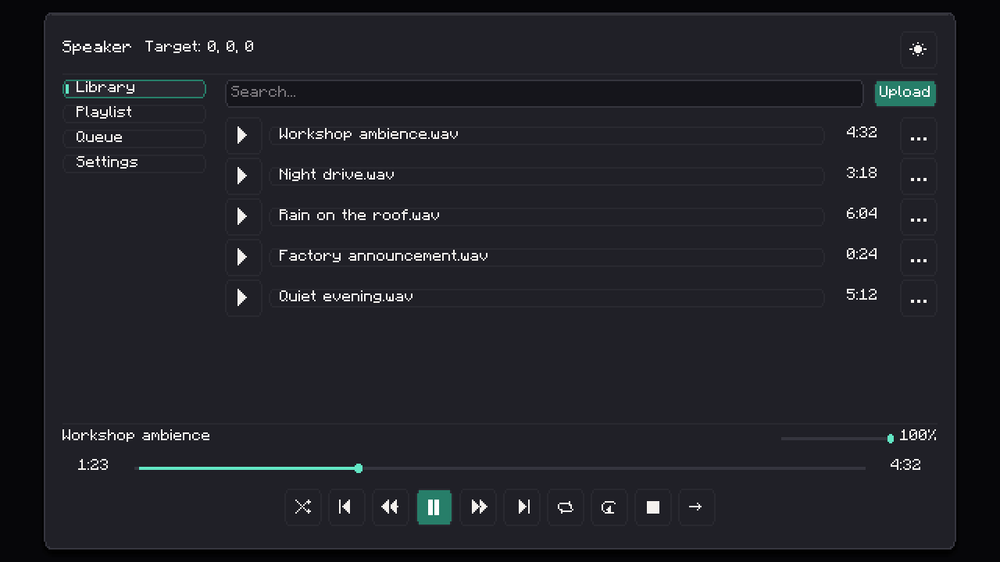
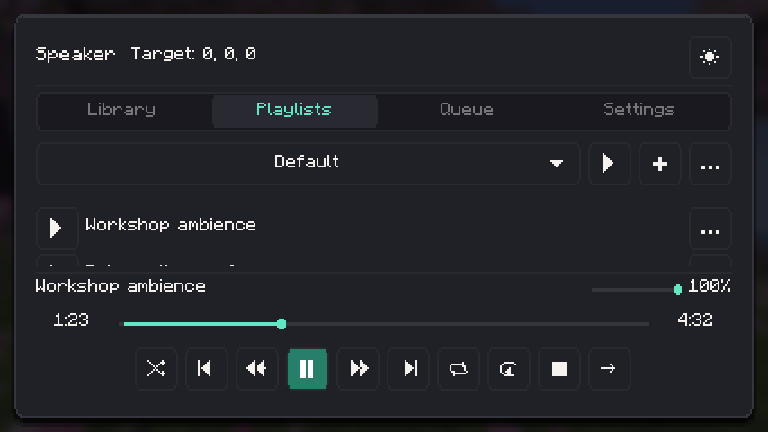

# Speaker UI visual audit — 2026-10-07

The earlier pass was insufficient. It checked bounds and interactions without requiring centered controls or aligned text. Its navigation also clicked before layout settled, so a screenshot could be labeled Settings while showing Library. That should not have been accepted as a visual audit.

## Corrections

| Finding | Correction |
| --- | --- |
| Transport spread across two rows at the left | One centered row with ten fixed-size icon targets |
| Text transport controls and font-dependent symbols | Pixel icons with descriptive hover tooltips and state-aware play, repeat and shuffle hints |
| Timeline timestamps and track durations at different heights | Centered row alignment and fixed endpoint/duration widths |
| Long names painting into neighboring controls | Ellipsis within the allocated width; full title on hover |
| Search empty-state action reaching into the player | Flexible empty-state content keeps its action inside the list area |
| Small proxy windows hiding controls | A responsive card with a scrollable form |
| Controller action hidden below the first screenful | Selected action first, above target configuration |
| Controller help occupying one line while painting several | Wrapped text contributes its full height to the switcher layout |
| Bright hover fills with pale icons/text | Primary foreground adapts to background luminance |
| Focus color filling transparent buttons | Opaque ghost fills preserve a distinct focus outline |
| Timestamp errors only appearing beneath the modal | Error message inside the modal; valid input closes it |

## Recorded verification

| Minecraft runtime | Final native cases | Result |
| --- | ---: | --- |
| Fabric 1.20.1 | 336 | Passed |
| Fabric 1.21.1 | 336 | Passed |
| NeoForge 26.1.2 | 336 | Passed |

All 1,008 final cases completed with their screenshot and success marker. Logs:
`build/ui-complete-fabric-1.20.1.log`, `build/ui-complete-fabric-1.21.1.log`,
`build/ui-complete-neoforge-26.1.2.log`. Earlier exploratory failures are retained;
the final runs supersede them.

The full probe covers Library, Playlist, Queue, Settings, empty/search/long-title states, paused playback, streams, context menus, delete/clear/jump dialogs, invalid and valid timestamps, hover states, missing proxies, scrolling, all eight controller actions, each controller form scrolled to its bottom, and proxy enabled/volume targets.

Four logical viewports are exercised: 320×240, 427×240, 640×360 and 854×480, each in dark and light themes. The assertion pass checks the actual selected tab, centered transport extents, timestamp and track-row baselines, icon size/tooltip presence, title widths, visible button bounds and wrapped controller text height. It also drags the timeline and submits timestamps through actual button clicks.

Screenshots are reviewed for spacing, contrast, clipping and readability in addition to these assertions. Scroll view clipping at the viewport edge is expected; the corresponding scrolled cases check the controls below it.

The probe uses sample data without entering a world. These results cover the mod's three custom screen families. The operating-system upload chooser and Patchouli's own book renderer are outside this UI-layout audit. Arbitrary resource-pack fonts and other screen sizes remain outside the recorded matrix.

The final five-loader build and `testAllVersions` passed: 411 Java tests
(277 shared, 41 for 1.20.1, 45 for 1.21.1, 48 for 26.1.2). The Python
verification harness also passed all 21 tests. The guide and package audits
confirmed the 23 chapters, 55 pages, assets, dependency metadata and creative-tab registration.

## Reviewed captures

[Desktop Library, dark](assets/ui-audit/library-dark.png),
[desktop Library, light](assets/ui-audit/library-light.png),
[small Library](assets/ui-audit/library-small.png),
[scrolled Settings](assets/ui-audit/settings-scrolled.png),
[small proxy](assets/ui-audit/proxy-small.png),
[small controller volume](assets/ui-audit/controller-volume-small.png),
[announcement selection](assets/ui-audit/announcement-small.png),
[timestamp error](assets/ui-audit/timestamp-error.png),
[hover tooltip](assets/ui-audit/hover-tooltip.png).

## Named playlist implementation and follow-up audit

The initial playlist editor supported one saved list. It now manages a persistent
catalog for each speaker network: create, rename, duplicate, delete, choose a
playlist, edit its tracks and choose a destination when adding from Library.
Browsing an inactive playlist leaves current playback and temporary requests
alone. Explicit Play switches the playback source. The previous single list
migrates to Default with its tracks, cursor, modes and queued requests preserved.

The selector uses an arrow, truncates long names before that arrow, and exposes
the full name on hover. Create and management actions use icon buttons with
hover tooltips. Name dialogs show validation inside the dialog; deletion requires
confirmation and explains playback consequences. The picker adapts to its
contents and scrolls when the catalog is full. You can delete every playlist.

| Runtime | Playlist scenarios | Final selector/picker scenarios | Result |
| --- | ---: | ---: | --- |
| Fabric 1.20.1 | 112 | 40 | Passed |
| Fabric 1.21.1 | 112 | 40 | Passed |
| NeoForge 26.1.2 | 112 | 40 | Passed |

These 456 targeted native cases cover the same four viewports and both themes.
The 112-case pass covers multiple playlists, independent browsing, long names,
create/rename/duplicate/delete dialogs, destination picking, a full catalog, empty
lists, queue and clear confirmation. The 40-case follow-up checks the final
selector arrow and adaptive picker layout. The complete probe now contains 416
cases; that expanded full matrix was not rerun for this feature. The earlier
1,008-case result above records the preceding UI overhaul.

Logs: `build/named-playlists-ui-fabric-1.20.1.log`,
`build/named-playlists-ui-fabric-1.21.1.log`,
`build/named-playlists-ui-neoforge-26.1.2-r2.log`, and
`build/named-playlists-picker-{fabric-1.20.1,fabric-1.21.1,neoforge-26.1.2}.log`.

Final five-loader builds and `testAllVersions` passed with 443 Java tests
(285 shared, 49 for 1.20.1, 53 for 1.21.1, 56 for 26.1.2).
Regression coverage exercises real server control, inactive editing without
interrupting playback, explicit playback switching, protected deletion, unknown
list IDs, limits, packet round trips, legacy JSON migration and registry disk
reload. The worst permitted Unicode catalog plus a full queue fits the packet
limit. Disk reload is tested in-process, not through a fresh game restart.
The Python harness passed 21 tests; guide/package checks confirmed 23 chapters,
56 pages, assets, required Patchouli metadata and the creative-tab book.
Final build log: `build/named-playlists-final-verified.log`.

Reviewed captures:
[selector](assets/ui-audit/playlists-dark.png),
[small picker](assets/ui-audit/playlist-picker-small.png),
[full catalog](assets/ui-audit/playlist-full-catalog-small.png),
[create](assets/ui-audit/playlist-create-small.png),
[rename](assets/ui-audit/playlist-rename-small.png),
[duplicate](assets/ui-audit/playlist-duplicate-small.png),
[delete](assets/ui-audit/playlist-delete-small.png),
[track destination](assets/ui-audit/playlist-destination-small.png),
[independent browsing](assets/ui-audit/playlist-browse.png).

## Settings separation and jump grouping follow-up

Removed the outer Settings card and the nested policy card. The settings now
share one flat scrollable content area. Wide layouts include a theme-colored
vertical divider between the navigation buttons and content; compact layouts
retain horizontal tabs. The timestamp input and jump action share an outlined
group inside the jump dialog.

The `settings_layout` pass completed 48 cases on each of Fabric 1.20.1,
Fabric 1.21.1 and NeoForge 26.1.2: 144 cases total. It covers Library, Settings,
scrolled Settings, the jump dialog, invalid timestamps and valid submission at
four sizes in both themes. Logs are `build/ui-settings-layout-fabric-1.20.1.log`,
`build/ui-settings-layout-fabric-1.21.1.log` and
`build/ui-settings-layout-neoforge-26.1.2-r2.log`. The first 26.1.2 compile found a
leftover wrapper; the corrected second run passed.

Reviewed [flat desktop Settings](assets/ui-audit/settings-flat-dark.png),
[small scrolled Settings](assets/ui-audit/settings-flat-scrolled-small.png),
[grouped jump controls](assets/ui-audit/jump-group-dark.png), and
[small light-theme jump dialog](assets/ui-audit/jump-group-light-small.png).

All five loader builds passed after these layout changes. Build log:
`build/ui-settings-layout-builds.log`.

## Settings localization and hover help follow-up

Every redstone mode now has a readable localized name and its own explanation.
The mode's label and explanation update together when cycled. Speaker ID, network
name, save buttons, range, dropoff, looping, volume and directional controls expose
hover help; sliders and their labels/values carry the explanation directly.
Proxy controls include the corresponding help. The proxy ID text describes both
physical power and linked Enabled controllers. The cone slider uses the same
5-350 degree limits as persisted server state.

The native `settings_help` cases check each of the seven modes, a real mode-cycle
click, the network name and the three directional settings. Each control is
scrolled into the viewport before its label and explanation are checked. Earlier
fixture failures involved scroll positioning and insufficient layout settling;
they were not accepted as successful visual passes. The full probe now has 512
cases; this follow-up targets the 96 new help cases per runtime.

Reviewed [small analog-volume help](assets/ui-audit/redstone-mode-help-small.png),
[mode cycling](assets/ui-audit/redstone-mode-cycle-help.png),
[directionality](assets/ui-audit/directionality-help.png),
[small cone help](assets/ui-audit/cone-help-small.png),
[rear attenuation](assets/ui-audit/rear-help.png) and
[network display name](assets/ui-audit/network-name-help.png).

All three targeted passes completed: 96 cases on Fabric 1.20.1, 96 on Fabric
1.21.1 and 96 on NeoForge 26.1.2 (288 total). Logs:
`build/settings-help-ui-fabric-1.20.1-r4.log`,
`build/settings-help-ui-fabric-1.21.1-r2.log`, and
`build/settings-help-ui-neoforge-26.1.2.log`.
The 28 Python tests include checks for missing mode labels/help, setting help and
matching the UI cone range to the persisted bounds. Final wording clarifies that
the legacy Loop switch must be disabled for playlist/queue advancement; the
volume percentage also exposes its explanation directly. These last tooltip-only
changes are covered by the build/resource checks, not a repeated native matrix.

Final five-loader builds and packaged localization checks passed. Build log:
`build/settings-help-final-builds.log`; package audit:
`build/settings-help-package-audit.json`.

## Controller-only redstone and transport icon review (2026-10-07)

Transport icons now use centered 18×18 masks in the existing 24×24 hit targets. Shuffle has two crossing arrows, repeat has two return arrows, and restart uses a larger loop. Theme contrast, disabled appearance and action tooltips remain intact.

The controller mode selector is a permanent, vertically aligned row above the scrolling form. Its menu lists only the jobs supported by the selected target and explains each on hover. Native picker fixtures move the real pointer onto the selector before clicking, matching how the library tooltip fixtures establish hover state. The first attempt caught a picker interaction fixture failure and an action-label alignment issue; the rerun must complete before reporting a pass.

Speaker Settings no longer exposes native redstone modes. Legacy input callbacks and policy packets cannot control playback, while manual player transport remains available. Controller-only input has deterministic same-target arbitration and transient volume overrides. Network/proxy relinking and unloaded proxy snapshots have explicit release behavior and regression coverage.

The default matrix now contains 552 cases, including 72 network mode-picker selections and 16 proxy mode-picker selections. The final `redstone_rework` group checks 376 relevant cases per runtime. Earlier full 512-case passes on Fabric 1.20.1 and NeoForge 26.1.2 preceded the final nine-job picker; the interrupted Fabric 1.21.1 rerun was not counted as a pass. Final validation results are recorded below.

The final fixtures resolve pending reactive layout through a zero-delta wheel event before reading coordinates, establish hover through the native pre-render path before clicking, and pace steps to avoid several inputs in one slow frame. Earlier 1.21.1 attempts caught stale-coordinate clicks and scroll positioning; those interrupted runs are not counted as passes. Settings wheel input retries only while the requested control remains clipped, then the existing visibility assertion and hover checks still apply.

Representative visuals: [nine-job picker at the smallest size](assets/ui-audit/controller-jobs-small.png), [proxy job choices](assets/ui-audit/controller-proxy-jobs.png), [dark transport](assets/ui-audit/transport-icons-dark.png), and [compact light transport](assets/ui-audit/transport-icons-light-small.png).

Final validation:

- 512 Java tests passed (`build/controller-final-tests-r4.log`), including all three runtime adapters, immediate fresh-speaker linking, duplicate cleanup prevention, arbitration, permissions, persistence and unloaded-target behavior.
- 28 Python tooling/resource checks passed (`build/controller-final-python.log`).
- The final relevant native matrix completed 376 cases per Minecraft runtime: Fabric 1.20.1 (`build/controller-ui-fabric-1.20.1-final.log`, repeated in `build/controller-ui-fabric-1.20.1-final-r4.log`), Fabric 1.21.1 (`build/controller-ui-fabric-1.21.1-final-r5.log`), and NeoForge 26.1.2 (`build/controller-ui-neoforge-26.1.2-final-r4.log`). This is 1,128 cases across the three adapters; it is the targeted group, not a new full 552-case run on each adapter.
- The first 1.20.1 pass and final 1.21.1/26.1.2 passes include actual 320×240 viewports. The 1.20.1 repeat inherited fullscreen and produced larger viewports; it is supplemental evidence. The probe now temporarily disables fullscreen for window-size requests and restores it afterward.
- Real dedicated-server/client verification passed on all five loaders (`build/controller-final-live-r3.log`). Each requires actual decoded client audio through start/pause/resume/seek/restart/stop/redstone phases, plus physical-controller cooperation and compiled guide contents. The four older loaders also require CC:Tweaked peripheral checks.
- The live cooperation fixture uses real placed controllers and redstone blocks: combined powered-playback inputs, duplicate toggles, simultaneous Toggle/Stop priority, maximum volume with different ceilings, removal restoring configured volume, and analog track selection bounded to playlist size. Detailed unload/reload, retargeting, permission and dimension isolation cases are covered by the Java suite rather than a fresh-JVM live restart.

The first live run caught missing state when a fresh speaker ID was assigned before its first block tick. The next run caught duplicate OpenAL cleanup deleting a reused source during restart. Both production paths were fixed, covered by regressions and passed the final live matrix. Earlier failed/aborted runs are retained as diagnostic evidence and are not counted as successful passes.

Final five-loader builds passed (`build/controller-final-builds-r2.log`). Packaged controller classes, nine mode labels, guide resources and required Patchouli metadata passed inspection (`build/controller-final-package-audit.json`). The extra windowed Fabric 1.20.1 Settings-help run completed 32 cases, including actual 320x240 (`build/controller-ui-fabric-1.20.1-windowed.log`).

## Playlist, sound settings and guide repairs (2026-10-07)

Playlist choices show `name - n tracks`, expose the full label on hover, and filter by case-insensitive name through a real text field. Native fixtures type a matching uppercase query and a no-match query. The queue uses one numbered playback order with inline Queued/Playlist sources; it does not spend the limited viewport on separate section headings. Restart uses a counterclockwise arrow and explains returning the current sound to 0:00.

The Settings Loop row is removed. Player-bar Repeat is authoritative, legacy Loop flags migrate once, transient decoder flags cannot overwrite saved preferences, and queue requests/manual Next bypass Track repeat appropriately. Directional sound controls share a heading/divider, align values at the right edge, and offer an eight-second local world preview based on the playback gain calculation. Teal marks range/cone edges; green means stronger gain and amber means quieter gain.

Controller changes save on closing. Real client/server reopen tests exercise every action and seven speaker settings. The initial live run caught missing directional/network fields in speaker block updates; the next attempt caught uninitialized directional UI signals. Both were fixed before successful verification. A subsequent 1.21.1 live run also caught a missing preview tick hook; the adapter now updates the preview. The preview-tooltip fixture initially treated every settings button as a legacy redstone mode button; its assertion now applies only to mode fixtures. Failed runs are diagnostic evidence, not passes.

The guide contains 23 entries and 152 conservatively paginated pages. Live checks use Patchouli's actual compiled page renderer and game font to reject text downscaling, text below the page bounds, and oversized headings. Book/circuit originals were resized directly to transparent 64×64 sprites. Imagegen produced a separate 32×32 controller casing using its original front as reference; see [texture provenance](assets/texture-provenance.md).

Representative screenshots: [queue order](assets/ui-audit/queue-order.png), [typed playlist search](assets/ui-audit/playlist-search.png), and [restart help](assets/ui-audit/restart-help.png), and [grouped directional settings](assets/ui-audit/directional-settings.png).

Continuous settings changes no longer use transport resync. Existing listeners receive updated emitter settings while retaining their decoder/source; true range exits still unsubscribe, and entrants start at the current timeline position. The shared screen adapter maintains native drag state across click/release. Volume, range and dropoff update the local speaker cache while publishing each drag change. The live probe checks 24 native drag movements before release and preserves the same active audio resource through server round trips.

Final evidence for this repair:

- 984 successful native UI cases: the broad 440-case 1.20.1 run (`build/ui-repair-native-120-r2.log`), 168 core cases on each adapter (`build/ui-repair-core-fabric-1.20.1.log`, `build/ui-repair-core-fabric-1.21.1.log`, `build/ui-repair-core-neoforge-26.1.2.log`), and 40 final 1.20.1 Settings-help cases (`build/ui-repair-settings-final-r2.log`). These are scoped runs, not a new full-screen matrix on every loader.
- Five-loader live playback/controller checks completed in `build/ui-repair-live-final-r5.log` (four older loader targets), `build/ui-repair-live-26-final-r6.log` (26.1.2), and the final book/preview repeat in `build/ui-repair-live-120-final-r7.log` (1.20.1).
- The added continuous-drag regression passed on all three adapters in `build/slider-live-r4.log`: 24 native movements before release, authoritative applied volume/range, the identical audio resource retained, and the full transport/controller/reopen/guide checks. Structured evidence is in `build/ui-slider-live-audit.json`.
- The earlier slider attempts caught a test clicking before layout was resolved; an intervening run timed out on initial world connection under memory pressure. The fixture now flushes layout before input, and the runner supports a smaller optional Gradle heap. Those attempts are not passes.

The compiled guide audit now checks the rendered text fragment's horizontal bounds as well as vertical bounds, font scale and headings. It also caught and removed corrupt UTF-8 sequences from several guide and tooltip strings. [World preview evidence](assets/ui-audit/directional-preview-world.png) shows the actual particles in a live world.

Final local validation: 527 Java tests across 78 suites and all five builds passed (`build/ui-slider-final-validation.log`); 30 Python checks passed (`build/ui-slider-final-python.log`). Every packaged loader jar contains the 23-entry/152-page guide, transparent 64-pixel book/circuit sprites, 32-pixel controller casing, clean English strings, and mandatory Patchouli metadata (`build/ui-slider-package-audit.json`).

### Player libraries and focused follow-up (2026-10-07)

Saved playlists now belong to a player UUID in world-local `player_playlists.json`. Speaker playback uses a separate copy and keeps its own queue. Empty catalogs round-trip and persist; the last playlist can be deleted without an implicit Default replacement. Legacy lists import once into their network owner's library, excluding transient queue and cursor state. Existing registry identifiers remain compatible.

Transport tooltips now use action words. Pointer clicks clear icon focus, while Tab/Enter focus remains available; Repeat only has an active outline when its mode is enabled. The controller is displayed as Speaker Controller, with a 16×16 casing. Directional preview uses larger colored particles and bright boundary markers. The optional Network name field now says Display name; Speaker ID remains the actual link.

This follow-up uses focused headless input, wire, persistence, ownership and queue regressions plus resource checks and builds. The full screen-preview matrix above was deliberately not rerun. The guide has one new short personal-library page; earlier native visual evidence remains historical.
`build/player-library-final-builds.log` confirms 547 Java tests with zero failures/errors and all five builds. `build/player-library-final-python.log` confirms 31 resource checks. `build/player-library-package-audit.json` checks the shipped 16×16 casing, controller labels, personal-library classes and 153 guide pages in every loader artifact.

### Concise help, proxy settings and marquee follow-up (2026-10-07)

Removed obvious save/click/hover instructions, obsolete help keys, repeated inline
instructions and duplicate guide paragraphs. The guide retains 23 chapters in 59 pages,
including crafting pages. Player-owned playlist behavior is reflected in the README and
technical reference. Text-page bounds were checked conservatively at 116 pixels using
six pixels per glyph and a maximum of 16 lines; this is a source check, not native rendering.

Proxy settings now use the speaker's flat scroll layout, header separator, aligned value
rows and explanatory help. Its independent volume/range/fade controls and live updates
remain intact. OpenUI marquee replaces manual substring truncation and ellipsis in audio
names, playlist selectors/rows, queue entries and the player title. Button-backed names
retain their original selection action, focus and active-state behavior.

Validation: all three source adapters compiled (`build/concise-proxy-marquee-compile.log`);
31 existing resource/localization checks passed (`build/concise-help-resource-tests.log`).
No full screen-preview matrix or client restart was run for this follow-up.

### Access management and stream UI (2026-10-07)

Settings now contains a flat Access group with owner display, claim/transfer actions,
access mode selection and trusted-player management. Online names and offline UUIDs are
accepted, with server validation before ownership is claimed. Policy snapshots are bounded,
personalized per viewer and serialized alongside the existing playback/catalog responses;
reopening requests authoritative values. Managers can request snapshots without playback
rights, allowing owners to recover an Operators-only choice. Playback and management controls
respect their separate permissions. Trusted lists accept up to 128 members.

Library exposes Add Stream even with no uploaded recordings. Its dialog validates public
HTTP(S) MP3/WAV URLs, offers Play/Queue/playlist destinations and explains disabled server
policy. The existing track-ID protocol limits URLs to 256 characters. Server content checks
remain authoritative, including blocked private URLs and disabled streaming.

Validation: the complete three-adapter test suite passed (`build/access-stream-tests.log`),
followed by focused access/stream/ownership regression tests on all three adapters
(`build/access-stream-final-regressions.log`). Final builds passed on all five loaders
(`build/access-stream-builds.log`), and packaged screens, labels and policy snapshot classes
were verified (`build/access-stream-package-audit.json`). All 31 resource/localization checks
passed (`build/access-stream-python.log`). Guide text bounds passed with 61 pages. Dialogs use
compact widths, short help and bounded scrolling; no native visual preview matrix or client
restart was run. This UI work does not change the external Java API authorization contract.

### Access management refinement after reported screenshots (2026-10-07)

The screenshots exposed two gaps in the preceding source audit: the dynamic access-mode
button could render a longer choice outside its measured width, and the generic Close
translation was absent. The trusted-player dialog also mounted an empty fixed-height list.

All three adapters now reserve space for the longest localized access choice, divide the
access row into bounded flexible labels and use OpenUI marquee text inside the selector.
The adjacent trusted-player action is simply Manage. Own-player identity displays You;
known online owners display their profile name, with the UUID retained for unknown offline
owners. Disabled marquee labels use reduced opacity. Close resolves through a shared key,
and ownership confirmation uses the shorter Transfer label.

The trusted dialog mounts either its empty message or its member list. Nonempty lists are
sized to their initial member count with a capped scroll viewport. Help distinguishes
playback access from access-management rights without narrating basic UI interactions.

Focused regression coverage measures access selectors at 160, 240 and 400 pixels with
all four choices; mounts the actual trusted-player dialog; and checks empty-to-populated
and populated-to-empty policy updates. Localization coverage now checks common dialog
labels and access/stream helpers, so a missing generic Close key is detected. Validation
is headless layout and packet tests, not a new native screenshot or full preview matrix.

Final focused checks passed on all three adapters (`build/access-ui-refinement-final.log`): 30 layout, focus and access-policy cases. All 32 resource/localization checks passed
(`build/access-ui-refinement-resources.log`). The running client has not been restarted.
